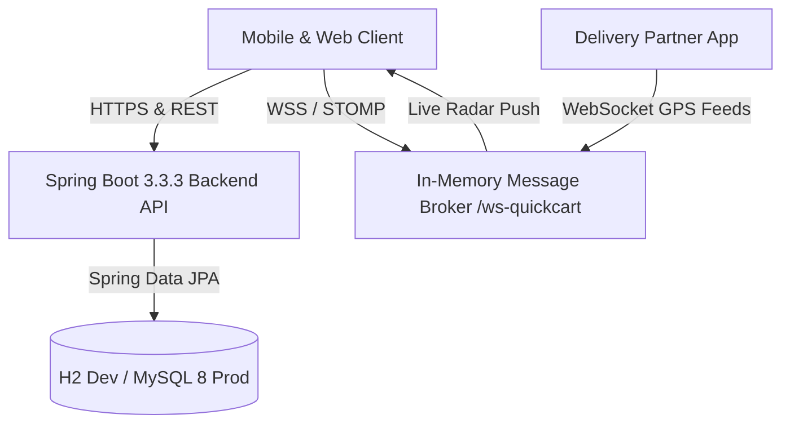

# ⚡ QuickCart — Instant 10-15 Min Grocery Delivery Platform

[](https://github.com/riya292100/new/actions/workflows/ci.yml)
[](https://github.com/riya292100/new/actions/workflows/codeql.yml)
[](https://spring.io/projects/spring-boot)
[](https://www.oracle.com/java/)
[](https://reactjs.org/)
[](https://vitejs.dev/)
[](https://www.docker.com/)
[](LICENSE)

**QuickCart** is a modern, enterprise-grade, fullstack quick-commerce grocery delivery platform (inspired by Blinkit, Zepto, and Instacart) engineered with a **Java 21 / Spring Boot 3** REST & WebSocket backend and a **React 18 / Vite** glassmorphism storefront, fully packaged as a **Progressive Web App (PWA)** and **Native Android App (Capacitor)** for Google Play Store release.

---

## 🌟 Key Capabilities

### 🛒 1. Customer Storefront
- **Hyper-Local Catalog**: Instant grocery catalog with category filtering, search autocomplete, brand filters, and deals of the day.
- **Micro-Cart & Free Delivery Milestones**: Dynamic cart drawer with live progress toward free delivery (₹199 threshold) and tax calculations.
- **Smart Promo Engine**: Percentage and flat amount discount coupons with minimum order limits and maximum discount caps.
- **Multi-Address Book**: Saved delivery addresses with GPS location detection and 6-digit metro pincode serviceability checks.
- **Real-Time Order Tracking**: 6-stage delivery progression timeline with real-time WebSocket rider GPS map simulation.

### 🍽️ 2. QuickCart Dining & Global Table Reservations
- **Global Discovery**: Search & filter curated fine-dining restaurants, trattorias, and bistros across Rome, Tokyo, New York, London, Paris, and Bengaluru.
- **Multi-Faceted Search**: Filter dynamically by cuisine, city, price level (`$` to `$$$$`), dietary preferences (Vegetarian, 100% Vegan), and dine-in availability.
- **Table Reservation Engine**: Instant reservations with guest count (1-20), seating area preference, special requests, and collision-free booking reference generation (`QC-DINE-XXXX`).
- **Verified Diner Reviews**: Submit and read community diner reviews and 5-star ratings with rolling average aggregation.
- **Saved Favorites**: Save and organize favorite dining spots across the world with 1-click bookmarks.

### 🚴 3. Delivery Partner (Driver) Portal
- **Real-Time Job Queue**: Accept or reject live orders in your delivery radius.
- **Order Progression Workflow**: Seamlessly advance order stages (`ACCEPTED` ➔ `PACKED` ➔ `OUT_FOR_DELIVERY` ➔ `DELIVERED`).
- **One-Click Navigation & Customer Calling**: In-app links to customer address and contact number.

### 🛡️ 4. Admin Control Center
- **Executive KPI Dashboard**: Live metrics for total sales, completed orders, active delivery partners, and inventory alerts.
- **Dark Store Catalog Management**: Add, update, delete, and restock products with instant threshold alerts.
- **Order Dispatcher**: Real-time order monitor with manual/automatic delivery partner assignment.
- **Promotions Manager**: Create and manage promo coupons and discount rules.

### 📱 5. Mobile & Google Play Store Ready
- **Progressive Web App (PWA)**: Web App Manifest, Service Worker offline caching, and 1-click home screen installation.
- **Native Android Project**: Capacitor Gradle project with release Keystore pre-configured for `.aab` / `.apk` generation.
- **Privacy Policy**: Google Play Store compliant privacy policy at [`privacy-policy.html`](file:///c:/Users/HP/Desktop/new/frontend/public/privacy-policy.html).

---

## 🏗️ Architecture & Tech Stack



| Layer | Technologies |
| :--- | :--- |
| **Frontend** | React 18.3, Vite 6.2, React Router 6, Lucide React, Canvas Confetti |
| **Backend** | Java 21 LTS, Spring Boot 3.3.3, Spring Data JPA, Spring Security, Spring WebSocket / STOMP, Lombok 1.18.36 |
| **Databases** | In-Memory H2 (Local / Test profiles), MySQL 8.0 (Production / Docker profile) |
| **Mobile App** | Capacitor 5, Progressive Web App (PWA), Service Worker offline cache |
| **Testing** | Vitest 3.0 (v8 coverage), React Testing Library, JUnit 5, Mockito, AssertJ, Spring MockMvc |
| **DevOps & CI** | GitHub Actions (CI & CodeQL), Docker Compose, Multi-stage Dockerfiles |

---

## 🚀 Quick Start with Docker Compose

Run the entire fullstack platform (MySQL 8.0, Spring Boot Backend, and Nginx React Frontend) in one command:

```bash
# 1. Clone repository
git clone https://github.com/riya292100/new.git
cd new

# 2. Launch multi-container stack
docker compose up --build
```

- **Frontend App**: `http://localhost:5173` (or `http://localhost:80`)
- **Backend REST API**: `http://localhost:8080`
- **Swagger API Docs**: `http://localhost:8080/swagger-ui.html`

---

## 💻 Local Development Setup from Fresh Clone

### Prerequisites
- **Node.js**: v20.x or v22.x LTS (`node --version`)
- **Java JDK**: Version 21 LTS (`java -version`)
- **Git** & **Maven** (or use included `./mvnw` / `mvnw.bat`)

### 1. Frontend Setup & Verification
```bash
# Navigate to frontend package
cd frontend

# Clean reproducible dependency install from lockfile
npm ci

# Run all 57 Vitest unit and integration test suites
npm test

# Run code style & static analysis linter
npm run lint

# Check formatting
npm run format:check

# Run tests with V8 coverage table (enforcing 75% line / statement threshold)
npm run coverage

# Build production bundle
npm run build

# Start local Vite development server (proxies /api to localhost:8080)
npm run dev
```
Storefront will be live at `http://localhost:5173`.

### 2. Backend Setup & Verification
```bash
# Navigate to backend directory
cd backend

# Run isolated JUnit 5 test suite with in-memory H2 database (Linux/macOS)
./mvnw clean test -Dspring.profiles.active=test

# Windows PowerShell:
.\mvnw.bat clean test "-Dspring.profiles.active=test"

# Run Spring Boot application locally with H2 development profile
./mvnw spring-boot:run -Dspring-boot.run.profiles=dev
```
REST API & Actuator will be live at `http://localhost:8080` with sample dark-store catalog and global restaurants automatically seeded by `DataSeeder`.

---

## 🧪 Automated Testing & Continuous Integration

Every commit is validated through GitHub Actions CI pipeline ([`.github/workflows/ci.yml`](.github/workflows/ci.yml)):
1. **Frontend Lint & Code Style**: Prettier verification + ESLint rules.
2. **Frontend Test Suite & Coverage**: Runs 102+ Vitest tests with V8 coverage thresholds.
3. **Frontend Production Build**: Vite bundle compilation.
4. **Backend Tests & Build**: JUnit 5 test execution against in-memory H2 database and `quickcart-backend-1.0.0.jar` packaging.
5. **CodeQL Security Analysis**: Static application security testing (SAST) for Java & JavaScript.

```bash
# Run all root test scripts:
npm run test:all
```

---

## 🔑 Demo Accounts & Instant Role Switcher

QuickCart includes instant role switching during local development:
- **Instant Demo Mode**: Toggle between **Customer**, **Delivery Partner**, and **Admin Portal** with 1-click in the UI header without entering credentials.
- **Default Seed Accounts**: Configured via application environment variables (`.env.example`) and seeded at first boot:
  - Customer (`customer@quickcart.com` / `password123`)
  - Delivery Partner (`driver@quickcart.com` / `password123`)
  - Dark Store Administrator (`admin@quickcart.com` / `password123`)

---

## 📄 License & Governance

- **License**: [MIT License](LICENSE)
- **Contributing Guide**: [CONTRIBUTING.md](CONTRIBUTING.md)
- **Security Policy**: [SECURITY.md](SECURITY.md)
- **Code of Conduct**: [CODE_OF_CONDUCT.md](CODE_OF_CONDUCT.md)
- **Changelog**: [CHANGELOG.md](CHANGELOG.md)
- **DevContainer**: [`.devcontainer/devcontainer.json`](.devcontainer/devcontainer.json)
