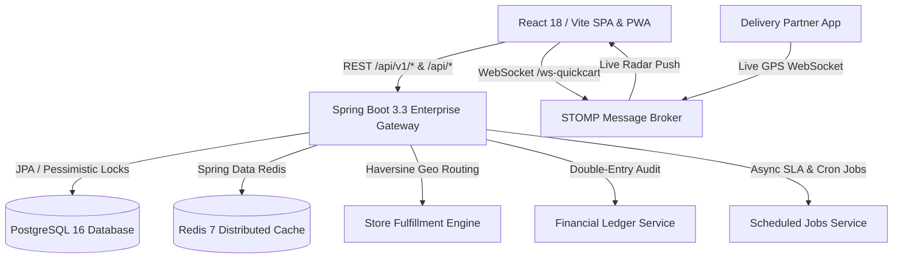

# ⚡ QuickCart — Enterprise Full-Stack Quick-Commerce Platform

[](https://github.com/riya292100/new/actions/workflows/ci.yml)
[](https://spring.io/projects/spring-boot)
[](https://www.oracle.com/java/)
[](https://www.postgresql.org/)
[](https://redis.io/)
[](https://flywaydb.org/)
[](https://reactjs.org/)
[](https://vitejs.dev/)
[](https://www.docker.com/)
[](LICENSE)

**QuickCart** is an enterprise-grade, high-performance quick-commerce delivery platform built with **Java 21 / Spring Boot 3** and **React 18 / Vite**. It provides a 10-15 minute grocery, fashion, and dining experience with real-time tracking, multi-store dark store fulfillment, thread-safe inventory locking, double-entry financial ledgers, customer support SLA management, return workflows, PostgreSQL persistence, Redis caching, loyalty cashback rewards, and table dining reservations.

---

## 🌟 Architecture & Enterprise Capabilities

### 🛒 1. Multi-Store Dark Store Fulfillment Engine
- **Geospatial Store Selection**: Automatic routing of customer cart items to the optimal dark store using the Haversine spherical distance formula, store service radiuses, and dynamic workload load balancing.
- **Dark Store Capacity Management**: Real-time tracking of `currentOrderLoad`, `maxCapacityOrdersPerHour`, manager contact info, and active operating hours (`06:00 - 02:00`).
- **Pessimistic Locking & Zero Overselling**: Thread-safe stock reservations utilizing `@Lock(LockModeType.PESSIMISTIC_WRITE)` and `@Version` optimistic controls, verified under 100 concurrent threads.

### 🛡️ 2. Advanced Security & Multi-Role RBAC
- **Account Lockout & Protection**: Automatic brute-force prevention locking accounts after 5 consecutive failed attempts for 15 minutes.
- **Password Reset & Verification Tokens**: Secure cryptographic token generation (`/api/v1/auth/forgot-password`, `/api/v1/auth/reset-password-confirm`, `/api/v1/auth/verify-email`).
- **Comprehensive RBAC**: Granular role enforcement for `ROLE_CUSTOMER`, `ROLE_STORE_MANAGER`, `ROLE_DELIVERY_PARTNER`, `ROLE_SUPPORT_AGENT`, and `ROLE_ADMIN`.

### 💰 3. Immutable Financial Ledger & Double-Entry Bookkeeping
- **Audit-Grade Ledger**: Append-only double-entry ledger (`FinancialLedgerEntry`) tracking all `PAYMENT`, `REFUND`, `WALLET_CREDIT`, `WALLET_DEBIT`, `LOYALTY_CASHBACK`, and `COUPON_DISCOUNT` movements.
- **Compensating Reversals**: Clean financial reversals that never overwrite historical records, guaranteeing audit compliance.
- **Admin Ledger Stream**: High-throughput paginated stream for finance teams at `GET /api/v1/admin/financial-ledger`.

### 🔄 4. Order State Machine, Audit Timeline & Returns
- **Order State Timeline**: Immutable audit trail (`OrderStateHistory`) capturing timestamps, actor emails, previous states, new states, and transition reasons (`GET /api/v1/orders/{id}/timeline`).
- **Returns & Inspection Workflow**: End-to-end customer return lifecycle (`REQUESTED` ➔ `APPROVED` ➔ `PICKUP_SCHEDULED` ➔ `RECEIVED` ➔ `INSPECTED` ➔ `REFUND_PENDING` ➔ `REFUNDED` / `REJECTED`) with 7-day delivery window validation and automated refund disbursements.

### 🎫 5. Customer Support Ticketing & SLA Engine
- **Priority-Based SLA Tracking**: Auto-calculated resolution SLAs (`URGENT` = 2h, `HIGH` = 6h, `MEDIUM` = 12h, `LOW` = 24h).
- **Threaded Communication**: Interactive ticket conversations supporting both public customer-agent messages and internal staff-only notes.

### 🧠 6. Intelligent Recommendations & Verified Reviews
- **Frequently Bought Together**: Basket co-occurrence matrix analyzing historical multi-item order patterns.
- **Similar & Trending Items**: Dynamic category, brand, and velocity recommendation pipelines.
- **Verified Purchase Reviews**: Strict database checks verifying that a reviewer has a completed `DELIVERED` order containing the product.

### 💰 7. QuickCash Customer Loyalty Hub
- **₹100 Welcome Bonus**: Instant sign-up reward credited automatically.
- **5% Cashback Engine**: Automatic cashback credited on every successfully delivered order.
- **Seamless Cart Redemption**: 1-click redemption during checkout with instant preview calculation.
- **Modularized Frontend Architecture**: Componentized into dedicated stations (`QuickCashHero`, `QuickCashRechargeStation`, `QuickCashCalculator`, `QuickCashPerks`, `QuickCashLedger`).

---

## 🏗️ System Architecture



---

## 🧪 Automated Testing & Verification

The project includes thorough unit, integration, and concurrency tests across both backend and frontend layers:

- **Backend Test Suite (Maven / JUnit 5 / Mockito)**:
  - **88 / 88 tests passing (100% BUILD SUCCESS)**.
  - Concurrency validation: `InventoryConcurrencyTest` (100 concurrent threads reserving limited inventory with 0 overselling).
  - Domain tests: `StoreFulfillmentServiceTest`, `FinancialLedgerServiceTest`, `ReturnServiceTest`, `SupportTicketServiceTest`, `WalletServiceTest`, `PaymentGatewayServiceTest`, `FraudDetectionServiceTest`, `AuthServiceTest`.
- **Frontend Test Suite (Vitest / Testing Library)**:
  - **120 / 120 tests passing across 62 test files (100% PASS)**.
  - Full coverage for storefront, cart drawer, checkout, QuickCash loyalty, dining booking, clothes catalog, admin dashboard, and delivery partner hooks.

---

## 🚀 Quick Start (Local Development)

### Prerequisites
- Java 21 JDK
- Node.js 18+ and npm
- Docker & Docker Compose (optional)

### 1. Run Full Stack via Docker Compose
```bash
docker compose up --build
```
- **Storefront & PWA**: `http://localhost:5173` (or `http://localhost:80`)
- **Backend API**: `http://localhost:8081` (or `http://localhost:8080`)
- **Swagger / OpenAPI Documentation**: `http://localhost:8081/swagger-ui.html`
- **H2 Web Console (dev mode)**: `http://localhost:8081/h2-console`
- **PostgreSQL**: `localhost:5432`
- **Redis**: `localhost:6379`

### 2. Run Locally from Source

#### Backend (Spring Boot 3)
```bash
cd backend
./mvnw spring-boot:run
```

#### Frontend (React + Vite)
```bash
cd frontend
npm install
npm run dev
```

---

## 🔑 Default Seeded Demo Credentials

| Role | Email | Password | Access Capabilities |
|---|---|---|---|
| **Admin** | `admin@quickcart.com` | `Admin@123` | Full admin control, financial ledger, store management, inventory, coupons, drivers |
| **Store Manager** | `manager@quickcart.com` | `Admin@123` | Dark store inventory adjustments, fulfillment capacity, dispatch operations |
| **Support Agent** | `support@quickcart.com` | `Admin@123` | Customer support ticket resolution, returns inspection, refund approvals |
| **Delivery Rider** | `driver@quickcart.com` | `Driver@123` | Delivery partner portal, live GPS simulator, order accept/reject |
| **Customer** | `customer@quickcart.com` | `Customer@123` | Grocery storefront, fashion hub, QuickCash wallet, table bookings, tickets, returns |

---

## 📜 License
This project is open-source and available under the [MIT License](LICENSE).
