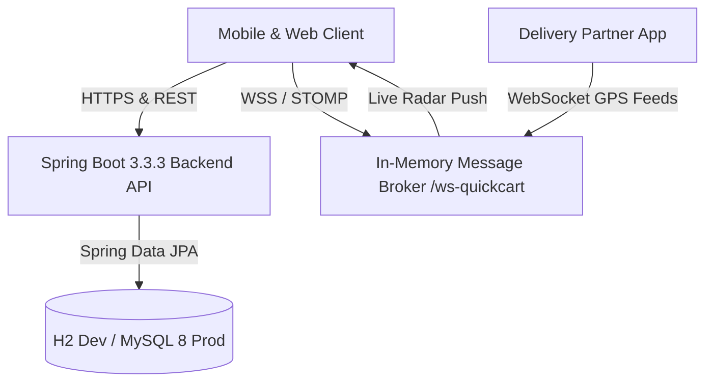

# ⚡ QuickCart — Instant 10-15 Min Grocery Delivery Platform

[](https://github.com/riya292100/new/actions/workflows/ci.yml)
[](https://github.com/riya292100/new/actions/workflows/codeql.yml)
[](https://spring.io/projects/spring-boot)
[](https://www.oracle.com/java/)
[](https://reactjs.org/)
[](https://vitejs.dev/)
[](https://www.docker.com/)
[](LICENSE)

**QuickCart** is a modern, enterprise-grade, fullstack quick-commerce grocery delivery platform (inspired by Blinkit, Zepto, and Instacart) engineered with a **Java 21 / Spring Boot 3** REST & WebSocket backend and a **React 18 / Vite** glassmorphism storefront, fully packaged as a **Progressive Web App (PWA)** and **Native Android App (Capacitor)** for Google Play Store release.

---

## 🌟 Key Capabilities

### 🛒 1. Customer Storefront
- **Hyper-Local Catalog**: Instant grocery catalog with category filtering, search autocomplete, brand filters, and deals of the day.
- **Micro-Cart & Free Delivery Milestones**: Dynamic cart drawer with live progress toward free delivery (₹199 threshold) and tax calculations.
- **Smart Promo Engine**: Percentage and flat amount discount coupons with minimum order limits and maximum discount caps.
- **Multi-Address Book**: Saved delivery addresses with GPS location detection and 6-digit metro pincode serviceability checks.
- **Real-Time Order Tracking**: 6-stage delivery progression timeline with real-time WebSocket rider GPS map simulation.

### 🚴 2. Delivery Partner (Driver) Portal
- **Real-Time Job Queue**: Accept or reject live orders in your delivery radius.
- **Order Progression Workflow**: Seamlessly advance order stages (`ACCEPTED` ➔ `PACKED` ➔ `OUT_FOR_DELIVERY` ➔ `DELIVERED`).
- **One-Click Navigation & Customer Calling**: In-app links to customer address and contact number.

### 🛡️ 3. Admin Control Center
- **Executive KPI Dashboard**: Live metrics for total sales, completed orders, active delivery partners, and inventory alerts.
- **Dark Store Catalog Management**: Add, update, delete, and restock products with instant threshold alerts.
- **Order Dispatcher**: Real-time order monitor with manual/automatic delivery partner assignment.
- **Promotions Manager**: Create and manage promo coupons and discount rules.

### 📱 4. Mobile & Google Play Store Ready
- **Progressive Web App (PWA)**: Web App Manifest, Service Worker offline caching, and 1-click home screen installation.
- **Native Android Project**: Capacitor Gradle project with release Keystore pre-configured for `.aab` / `.apk` generation.
- **Privacy Policy**: Google Play Store compliant privacy policy at [`privacy-policy.html`](file:///c:/Users/HP/Desktop/new/frontend/public/privacy-policy.html).

---

## 🏗️ Architecture & Tech Stack



---

## 🚀 Quick Start with Docker Compose

Run the entire fullstack platform (MySQL 8.0, Spring Boot Backend, and Nginx React Frontend) in one command:

```bash
# 1. Clone repository
git clone https://github.com/riya292100/new.git
cd new

# 2. Launch multi-container stack
docker compose up --build
```

- **Frontend App**: `http://localhost:5173` (or `http://localhost:80`)
- **Backend REST API**: `http://localhost:8080`
- **Swagger API Docs**: `http://localhost:8080/swagger-ui.html`

---

## 💻 Local Development Setup

### Backend (Spring Boot 3.3.3 / Java 21)
```bash
cd backend
mvn clean spring-boot:run
```

### Frontend (React 18 / Vite 5)
```bash
cd frontend
npm install
npm run dev
```

---

## 🧪 Automated Testing

### Frontend Test Suite (Vitest + React Testing Library)
```bash
cd frontend
npm test
```

### Backend Test Suite (JUnit 5 & Mockito)
```bash
cd backend
mvn test
```

### Linting & Formatting
```bash
cd frontend
npm run lint
npm run format
```

---

## 🔑 Demo Accounts

| Role | Email | Password |
| :--- | :--- | :--- |
| **Customer** | `customer@quickcart.com` | `Customer@123` |
| **Delivery Driver** | `driver@quickcart.com` | `Driver@123` |
| **Admin** | `admin@quickcart.com` | `Admin@123` |

---

## 📄 License & Governance

- **License**: [MIT License](LICENSE)
- **Contributing**: [CONTRIBUTING.md](CONTRIBUTING.md)
- **Security Policy**: [SECURITY.md](SECURITY.md)
- **Code of Conduct**: [CODE_OF_CONDUCT.md](CODE_OF_CONDUCT.md)
- **Changelog**: [CHANGELOG.md](CHANGELOG.md)
