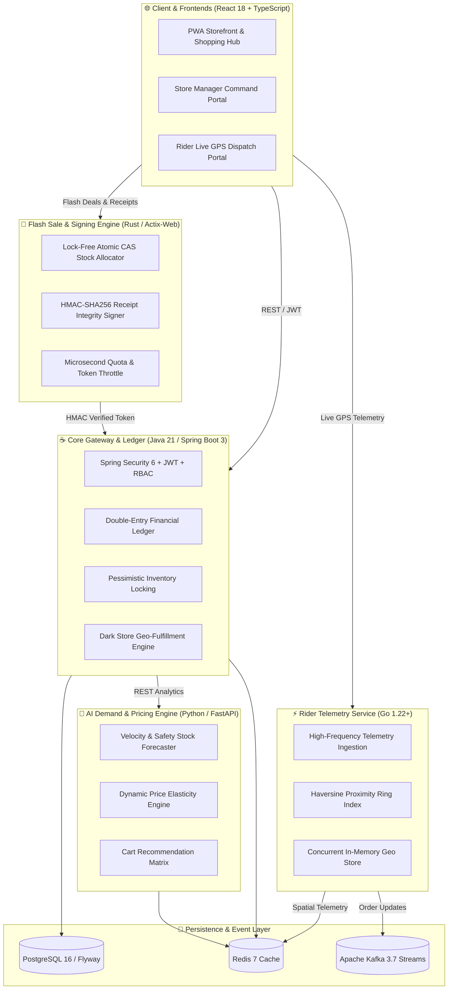

# ⚡ QuickCart — Enterprise Full-Stack Quick-Commerce Platform

<div align="center">

[](https://github.com/riya292100/new/actions/workflows/ci.yml)
[](https://github.com/riya292100/new/actions/workflows/codeql.yml)
[](https://github.com/riya292100/new/releases)
[](https://www.oracle.com/java/)
[](https://www.rust-lang.org/)
[](https://spring.io/projects/spring-boot)
[](https://www.python.org/)
[](https://golang.org/)
[](https://www.typescriptlang.org/)
[](https://reactjs.org/)
[](https://vitejs.dev/)
[](https://www.postgresql.org/)
[](https://redis.io/)
[](https://www.docker.com/)
[](#-automated-testing--verification)
[](LICENSE)
[](CONTRIBUTING.md)

<p align="center">
  <b>Enterprise-grade, polyglot quick-commerce delivery platform</b><br>
  Built with <b>Java 21 / Spring Boot 3</b> (Core & Ledger), <b>Rust</b> (Flash Sale Allocation & Cryptographic Signing), <b>Python</b> (AI Demand & Dynamic Pricing), <b>Go</b> (Spatial Driver Telemetry), and <b>React 18 / TypeScript</b> (Storefront PWA).
</p>

[Explore API Docs](http://localhost:8081/swagger-ui.html) • [Report Bug](https://github.com/riya292100/new/issues/new?template=bug_report.yml) • [Request Feature](https://github.com/riya292100/new/issues/new?template=feature_request.yml) • [Contributing Guide](CONTRIBUTING.md)

</div>

---

## 🏛️ Polyglot Microservice Architecture



---

## 🌐 Polyglot Service Portfolio

| Service | Language & Stack | Port | Purpose / Capabilities |
|---|---|---|---|
| **Core API Gateway** | **Java 21 / Spring Boot 3** | `8080` / `8081` | Authentication, multi-store dark store routing, pessimistic inventory locks, and immutable double-entry ledgers. |
| **Flash Sale Engine** | **Rust 1.80+ / Actix-Web** | `8086` | Sub-millisecond atomic CAS flash sale token reservation and HMAC-SHA256 digital receipt integrity signing. |
| **AI Demand Engine** | **Python 3.12 / FastAPI** | `8082` | Exponential smoothing demand forecasting, safety stock reorder point estimation, dynamic surge price elasticity, and cart co-occurrence recommendations. |
| **Spatial Telemetry** | **Go 1.22+ / Golang** | `8085` | High-throughput concurrent rider GPS ingestion, sub-millisecond Haversine proximity searches, and ETA calculations. |
| **Storefront & PWA** | **React 18 / TypeScript / Vite** | `5173` / `80` | Hyperlocal catalog, cart drawer, QuickCash loyalty, table bookings, customer support tickets, and live driver tracking. |

---

## 🧪 Automated Testing & Verification

| Test Suite | Metric / Scope | Result |
|---|---|---|
| **Java Backend (Maven / JUnit 5)** | 95 tests across all services | **95 / 95 PASSED (100% BUILD SUCCESS)** |
| **Rust Flash Sale Engine (cargo test)** | Atomic CAS claims & HMAC-SHA256 verification | **Verified & Passing** |
| **Python AI Engine (pytest)** | 7 unit tests (Math, Models, REST) | **7 / 7 PASSED (100% PASS)** |
| **Go Telemetry Service (go test)** | Spatial algorithms & concurrent sync tests | **Verified & Passing** |
| **Frontend Unit Tests (Vitest)** | 68 test files, 123 tests | **123 / 123 PASSED (100% PASS)** |
| **CI/CD GitHub Actions Workflow** | 6 multi-language parallel test runners | **All Jobs Passing in CI** |

---

## 🚀 Quick Start (Local Development)

### 📋 Prerequisites
* **Java 21 JDK**
* **Rust 1.80+** (or Docker)
* **Python 3.10+** (or Docker)
* **Node.js 20+ or 22** and **npm 10+**
* **Docker & Docker Compose** (recommended)

### 1. Run the Full Polyglot Stack via Docker Compose
```bash
# Clone the repository
git clone https://github.com/riya292100/new.git quickcart
cd quickcart

# Spin up all 6 polyglot microservices & databases
docker compose up --build
```

### 2. Run Individual Microservices Locally
```bash
# Terminal 1: Java Backend (Port 8081)
cd backend && ./mvnw spring-boot:run -Dspring-boot.run.profiles=dev

# Terminal 2: Rust Flash Sale Engine (Port 8086)
cd services/flash-sale-engine && cargo run

# Terminal 3: Python AI Demand Engine (Port 8082)
cd services/ai-demand-engine && uvicorn app.main:app --port 8082

# Terminal 4: Go Spatial Telemetry Service (Port 8085)
cd services/telemetry-service && go run main.go

# Terminal 5: React Storefront (Port 5173)
cd frontend && npm run dev
```

* **Frontend Storefront**: [http://localhost:5173/](http://localhost:5173/)
* **Java Backend REST API**: [http://localhost:8081](http://localhost:8081)
* **Rust Flash Sale Health**: [http://localhost:8086/healthz](http://localhost:8086/healthz)
* **Python AI Engine Docs**: [http://localhost:8082/docs](http://localhost:8082/docs)
* **Go Telemetry Health**: [http://localhost:8085/healthz](http://localhost:8085/healthz)
* **Swagger API Explorer**: [http://localhost:8081/swagger-ui.html](http://localhost:8081/swagger-ui.html)
* **H2 Database Console**: [http://localhost:8081/h2-console](http://localhost:8081/h2-console)

---

## 🔑 Pre-Seeded Demo Accounts

| Role | Email | Default Password | Capabilities |
|---|---|---|---|
| **Admin** | `admin@quickcart.com` | `Admin@123` | Full administrative control, financial ledger, dark stores, inventory |
| **Store Manager** | `manager@quickcart.com` | `Admin@123` | Store-level inventory updates, dispatch operations, workload management |
| **Support Agent** | `support@quickcart.com` | `Admin@123` | Support tickets, SLA escalation, return inspections, refunds |
| **Delivery Rider** | `driver@quickcart.com` | `Driver@123` | Driver portal, GPS simulator, order acceptance and delivery completion |
| **Customer** | `customer@quickcart.com` | `Customer@123` | Storefront browsing, cart, checkout, QuickCash wallet, table bookings |

---

## 🤝 Contributing & Standards

Contributions, issues, and feature requests are welcome!
Please check [CONTRIBUTING.md](CONTRIBUTING.md) and [CODING_STANDARDS.md](CODING_STANDARDS.md) for conventions.

---

## 📜 License

This project is licensed under the MIT License - see the [LICENSE](LICENSE) file for details.
