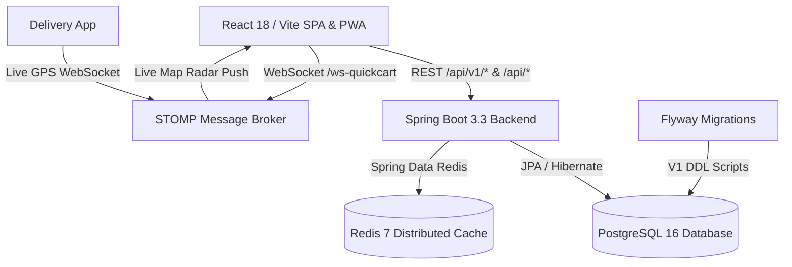

# ⚡ QuickCart — Production Full-Stack Quick-Commerce Platform

[](https://github.com/riya292100/new/actions/workflows/ci.yml)
[](https://spring.io/projects/spring-boot)
[](https://www.oracle.com/java/)
[](https://www.postgresql.org/)
[](https://redis.io/)
[](https://flywaydb.org/)
[](https://reactjs.org/)
[](https://vitejs.dev/)
[](https://www.docker.com/)
[](LICENSE)

**QuickCart** is an enterprise-grade, high-performance quick-commerce delivery platform built with **Java 21 / Spring Boot 3** and **React 18 / Vite**. It provides a 10-15 minute grocery and fashion shopping experience with real-time tracking, dark store inventory reservation with concurrency controls, PostgreSQL migrations, Redis caching, loyalty cashback rewards, and table dining reservations.

---

## 🌟 Key Capabilities

### 🛒 1. Customer Storefront & Grocery Delivery
- **Hyper-Local Catalog & Search**: Real-time grocery catalog with category filtering, brand filters, and instant search autocomplete.
- **Dark Store Inventory & Reservation**: Multi-store stock tracking with pessimistic write locking (`LockModeType.PESSIMISTIC_WRITE`) and optimistic versioning (`@Version`) preventing overselling under concurrency.
- **Server-Side Pricing & Cart Integrity**: Cart totals, taxes, delivery fees, and promo calculations verified strictly on backend.
- **Order State Machine**: Strict lifecycle: `PLACED` ➔ `CONFIRMED` ➔ `PACKING` ➔ `READY_FOR_PICKUP` ➔ `OUT_FOR_DELIVERY` ➔ `DELIVERED`.
- **Payment Verification & Webhooks**: HMAC SHA-256 digital signature validation and automatic refund handling on order cancellation.
- **Real-Time Tracking**: WebSocket STOMP live rider GPS tracking and order stage updates.

### 💰 2. QuickCash Customer Loyalty Wallet
- **₹100 Welcome Bonus**: Instant sign-up reward credited automatically.
- **5% Cashback Engine**: Automatic cashback credited on every successfully delivered order.
- **Seamless Cart Redemption**: 1-click redemption during checkout with instant preview calculation.
- **Immutable Transaction Ledger**: Complete history with transaction reference tracking and running balances.

### 👗 3. Clothes & Fashion Shopping Hub
- **Dedicated Fashion Tab**: Browse apparel for Men, Women, and Kids with size selectors (XS-XXL), high-resolution imagery, and discount badges.
- **Integrated Checkout**: Add apparel and groceries in the same seamless checkout pipeline.

### 🍽️ 4. QuickCart Dining & Table Reservations
- **Global Discovery**: Curated dining across Tokyo, Paris, New York, London, Rome, and Bengaluru.
- **Table Booking**: Instant reservations with seating options, dietary requirements, and unique confirmation codes.
- **Verified Diner Reviews**: Reviews validated against completed restaurant visits.

### 🚴 5. Delivery Partner Portal
- **Live Dispatch Queue**: Accept or reject delivery assignments in real-time.
- **Stage Progression Workflow**: Step through pickup, dispatch, and contactless delivery.
- **Live Location Simulator**: Stream GPS coordinates to customer tracking maps.

### 🛡️ 6. Admin Control Center & Dark Store Operations
- **KPI Metrics Dashboard**: Live analytics for revenue, orders, active drivers, and low-stock alerts.
- **Stock Management & Adjustments**: Inventory reconciliation, threshold adjustments, and audit trails.
- **Role-Based Access Control**: Strict RBAC for `ROLE_CUSTOMER`, `ROLE_STORE_MANAGER`, `ROLE_DELIVERY_PARTNER`, and `ROLE_ADMIN`.

---

## 🏗️ Architecture & Tech Stack



### Backend Tech Stack
- **Java 21** / **Spring Boot 3.3.3**
- **Spring Security** with Stateless JWT Authentication & Refresh Token Rotation
- **PostgreSQL 16** with **Flyway** Database Migrations (`V1__initial_schema.sql`)
- **Redis 7** for fast product caching and session rate limiting
- **WebSocket (STOMP)** for real-time order tracking & delivery partner radar
- **Testcontainers** (PostgreSQL) + **JUnit 5** + **Mockito**

### Frontend Tech Stack
- **React 18.3** with **Vite 6**
- **Tailwind CSS** with Glassmorphism Design System & Lucide Icons
- **Vitest** + **Testing Library** (61 test files, 117 tests passing)
- **Progressive Web App (PWA)** with Service Worker offline caching
- **Capacitor Android** configuration for Google Play Store APK/AAB builds

---

## 🚀 Quick Start (Local Development)

### Prerequisites
- Java 17 or 21 JDK
- Node.js 18+ and npm
- Docker and Docker Compose (optional for containerized run)

### Option 1: Run Full Stack via Docker Compose (Recommended)
```bash
docker compose up --build
```
- **Storefront & PWA**: `http://localhost:5173` (or `http://localhost:80`)
- **Backend API**: `http://localhost:8080`
- **Swagger / OpenAPI Documentation**: `http://localhost:8080/swagger-ui.html`
- **PostgreSQL**: `localhost:5432`
- **Redis**: `localhost:6379`

### Option 2: Run Standalone Backend & Frontend
1. **Start Backend**:
   ```bash
   cd backend
   ./mvnw spring-boot:run
   ```
   *(Defaults to H2 in-memory mode on `http://localhost:8081` or `8080`)*

2. **Start Frontend**:
   ```bash
   cd frontend
   npm install
   npm run dev
   ```

---

## 🔐 Default Demo Accounts

| Role | Email | Password | Access / Capabilities |
| :--- | :--- | :--- | :--- |
| **Customer** | `customer@quickcart.com` | `Customer@123` | Storefront, QuickCash Wallet, Cart, Checkout, Order Tracking |
| **Delivery Partner** | `driver@quickcart.com` | `Driver@123` | Delivery Partner Dispatch Board, GPS Radar, Order Acceptance |
| **Admin** | `admin@quickcart.com` | `Admin@123` | Full Admin KPI Dashboard, Product Catalog, Inventory, Dispatch |

---

## 🧪 Testing & Quality Assurance

### Run Backend Unit & Integration Tests
```bash
cd backend
./mvnw clean test -Dspring.profiles.active=test
```

### Run Frontend Test Suite
```bash
cd frontend
npm test -- --run
```

---

## 📄 License
This project is licensed under the MIT License — see the [LICENSE](LICENSE) file for details.
