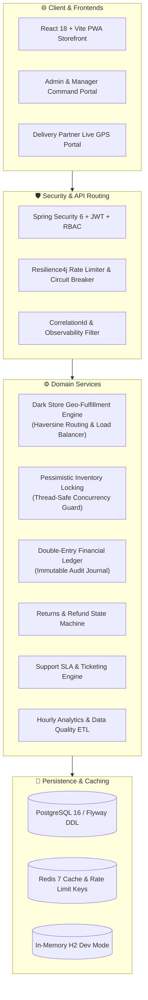

# ⚡ QuickCart — Enterprise Full-Stack Quick-Commerce Platform

<div align="center">

[](https://github.com/riya292100/new/actions/workflows/ci.yml)
[](https://github.com/riya292100/new/actions/workflows/codeql.yml)
[](https://github.com/riya292100/new/releases)
[](https://www.oracle.com/java/)
[](https://spring.io/projects/spring-boot)
[](https://reactjs.org/)
[](https://vitejs.dev/)
[](https://www.postgresql.org/)
[](https://redis.io/)
[](https://flywaydb.org/)
[](https://www.docker.com/)
[](#-automated-testing--verification)
[](LICENSE)
[](CONTRIBUTING.md)

<p align="center">
  <b>Enterprise-grade, hyperlocal 10-15 minute grocery, fashion & dining delivery platform</b><br>
  Built with Java 21, Spring Boot 3, React 18, Vite, PostgreSQL, Redis, and Docker.
</p>

[Explore API Docs](http://localhost:8081/swagger-ui.html) • [Report Bug](https://github.com/riya292100/new/issues/new?template=bug_report.yml) • [Request Feature](https://github.com/riya292100/new/issues/new?template=feature_request.yml) • [Contributing Guide](CONTRIBUTING.md)

</div>

---

## 🏛️ System Architecture



---

## 🌟 Key Enterprise Capabilities

### 🛒 1. Multi-Store Dark Store Fulfillment Engine
- **Geospatial Geo-Allocation**: Automated nearest dark-store discovery via spherical Haversine distance computations and workload balancing.
- **Dark Store Capacity Engine**: Real-time store throughput limits (`maxCapacityOrdersPerHour`, `currentOrderLoad`, active operating hours `06:00 - 02:00`).
- **Thread-Safe Inventory Locking**: Pessimistic write locks (`@Lock(LockModeType.PESSIMISTIC_WRITE)`) and optimistic versioning (`@Version`) preventing overselling under 100+ concurrent threads.

### 🛡️ 2. Security, Multi-Role RBAC & Audit Trails
- **Brute-Force Protection**: Automatic account lockout for 15 minutes after 5 consecutive failed login attempts.
- **Granular RBAC**: Strict role policies across `ROLE_CUSTOMER`, `ROLE_STORE_MANAGER`, `ROLE_DELIVERY_PARTNER`, `ROLE_SUPPORT_AGENT`, and `ROLE_ADMIN`.
- **Distributed MDC Tracking**: Cross-thread propagation of `X-Correlation-ID`, `X-Request-ID`, and execution latency headers.

### 💰 3. Double-Entry Financial Ledger
- **Audit-Grade Ledger**: Append-only double-entry movements across `PAYMENT`, `REFUND`, `WALLET_CREDIT`, `WALLET_DEBIT`, `LOYALTY_CASHBACK`, and `COUPON_DISCOUNT`.
- **Compensating Entries**: Accounting compliance without destructive updates to historical records.
- **Real-Time Stream**: Paginated transaction streaming endpoint at `GET /api/v1/admin/financial-ledger`.

### 🔄 4. Order State Machine & Support SLA Engine
- **Order State Timeline**: Immutable lifecycle audit trail (`OrderStateHistory`) at `GET /api/v1/orders/{id}/timeline`.
- **Automated Return Inspection**: Multi-stage state machine (`REQUESTED` ➔ `APPROVED` ➔ `PICKUP_SCHEDULED` ➔ `RECEIVED` ➔ `INSPECTED` ➔ `REFUNDED` / `REJECTED`) with automated wallet refunds.
- **Dynamic SLA Tracker**: Tiered resolution SLAs (`URGENT` = 2h, `HIGH` = 6h, `MEDIUM` = 12h, `LOW` = 24h).

---

## 🧪 Automated Testing & Verification

| Test Suite | Metric / Scope | Result |
|---|---|---|
| **Backend Unit & Integration (Maven / JUnit 5)** | 95 tests across all services | **95 / 95 PASSED (100% BUILD SUCCESS)** |
| **Inventory Concurrency Stress Test** | 100 concurrent threads on 20 stock | **20 Succeeded, 80 Rejected (0 Overselling)** |
| **Database Migration Test (Flyway)** | Zero-downtime DDL validation | **Verified & Passing** |
| **Frontend Unit & Component Tests (Vitest)** | 68 test files, 123 tests | **123 / 123 PASSED (100% PASS)** |
| **Frontend Production Build (Vite)** | 1,776 modules transformed | **Built in < 9s (0 Errors)** |
| **CI/CD GitHub Actions Workflow** | Lint, Format, Test, Build, Docker | **Passing in CI** |

---

## 🚀 Quick Start (Local Development)

### 📋 Prerequisites
* **Java 21 JDK** (Eclipse Temurin or OpenJDK)
* **Node.js 20+ or 22** and **npm 10+**
* **Docker & Docker Compose** (optional)

### 1. Run via Docker Compose (Recommended)
```bash
# Clone the repository
git clone https://github.com/riya292100/new.git quickcart
cd quickcart

# Start fullstack stack
docker compose up --build
```

### 2. Run Manually (Local Dev Mode)
```bash
# Terminal 1: Start Backend (Port 8081 with in-memory H2 DB)
cd backend
./mvnw spring-boot:run -Dspring-boot.run.profiles=dev

# Terminal 2: Start Frontend (Port 5173)
cd frontend
npm ci
npm run dev
```

* **Frontend Storefront**: [http://localhost:5173/](http://localhost:5173/)
* **Backend REST API**: [http://localhost:8081](http://localhost:8081)
* **Swagger API Explorer**: [http://localhost:8081/swagger-ui.html](http://localhost:8081/swagger-ui.html)
* **H2 Database Console**: [http://localhost:8081/h2-console](http://localhost:8081/h2-console) (JDBC URL: `jdbc:h2:mem:quickcart_dev_db`, User: `sa`, Password: blank)

---

## 🔑 Pre-Seeded Demo Accounts

| Role | Email | Default Password | Capabilities |
|---|---|---|---|
| **Admin** | `admin@quickcart.com` | `Admin@123` | Full administrative control, financial ledger, dark stores, inventory |
| **Store Manager** | `manager@quickcart.com` | `Admin@123` | Store-level inventory updates, dispatch operations, workload management |
| **Support Agent** | `support@quickcart.com` | `Admin@123` | Support tickets, SLA escalation, return inspections, refunds |
| **Delivery Rider** | `driver@quickcart.com` | `Driver@123` | Driver portal, GPS simulator, order acceptance and delivery completion |
| **Customer** | `customer@quickcart.com` | `Customer@123` | Storefront browsing, cart, checkout, QuickCash wallet, table bookings |

---

## 🤝 Contributing

Contributions, issues, and feature requests are welcome!
Please check the [CONTRIBUTING.md](CONTRIBUTING.md) and [CODE_OF_CONDUCT.md](CODE_OF_CONDUCT.md) for details on our code of conduct and development workflow.

---

## 📜 License

This project is licensed under the MIT License - see the [LICENSE](LICENSE) file for details.
