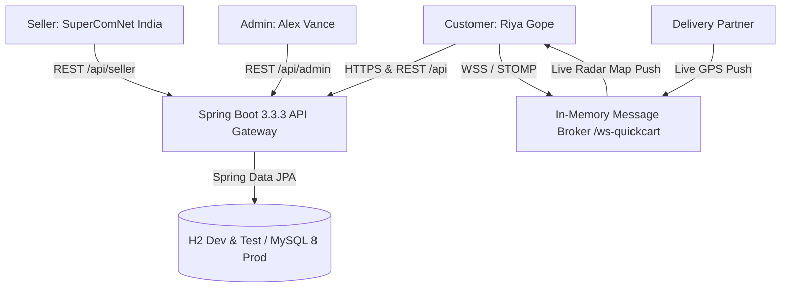

# ⚡ QuickCart — Modern Indian E-Commerce Marketplace & 1-Hour Delivery Platform

[](https://github.com/riya292100/new/actions/workflows/ci.yml)
[](https://github.com/riya292100/new/actions/workflows/codeql.yml)
[](https://spring.io/projects/spring-boot)
[](https://www.oracle.com/java/)
[](https://reactjs.org/)
[](https://vitejs.dev/)
[](https://www.docker.com/)
[](LICENSE)

**QuickCart** is a modern, enterprise-grade, fullstack Indian E-Commerce Marketplace and instant delivery platform engineered with a **Java 21 / Spring Boot 3** REST & WebSocket backend and a **React 18 / Vite** glassmorphism storefront, featuring pan-India 1-hour express delivery verification, GST tax invoice generation, verified seller hubs, and executive admin controls.

---

## 🌟 Key Capabilities

### 🛒 1. Indian Marketplace & Customer Storefront
- **13+ Mega Categories**: Electronics, Mobiles & Tablets, Fashion & Apparel, Beauty & Personal Care, Home & Kitchen, Fresh Groceries, Dairy & Bakery, Snacks & Beverages, Gourmet & Organic, Baby Care, Pet Supplies, Books & Stationery, Wellness & Fitness.
- **⚡ Pan-India 1-Hour SuperFast Delivery**: Real-time pin-code availability validation for 20+ Tier-1/Tier-2 Indian cities (Delhi, Mumbai, Bengaluru, Hyderabad, Kolkata, Chennai, Pune, Ahmedabad, etc.).
- **Product Details & Flipkart-Grade Shopping Features**: Multi-image zoom gallery, technical specifications table, verified brand warranty, No-Cost EMI plans, bank offer discounts, customer rating breakdown, and verified customer reviews.
- **"⚡ Buy Now" & Multi-Step Checkout**: Instant 1-click buy flow from product cards straight to address selection, delivery speed tier selection (⚡ 1-Hour Express vs 📦 Standard Delivery), and payments.
- **Persistent Wishlist & Micro-Cart**: Instant wishlist toggle, local storage sync, and dynamic free delivery milestones.
- **Official GST Tax Invoice Generator**: Print-ready and downloadable PDF tax invoice with GSTIN, CIN, HSN breakdown, and itemized receipts from Order Tracking and Order History.

### 🏪 2. Verified Seller Hub (`SuperComNet India`)
- **Seller Dashboard**: Real-time KPI cards for gross sales, units shipped, active listings, and merchant rating.
- **Catalog Management**: Add new products with specifications, warranty details, discount tiers, and instant stock level controls.

### 🛡️ 3. Admin Control Center (`Alex Vance`)
- **Executive KPI Dashboard**: Live metrics for total sales, completed orders, active sellers, and low-stock alerts.
- **Product & Inventory Moderation**: Instant catalog search, price modifications, and stock replenishments.
- **Promotions & Coupon Manager**: Create percentage/flat coupons with minimum cart thresholds and maximum discount caps.

### 🚴 4. Delivery Partner (Driver) Portal & Live Radar GPS
- **Live Dispatch Queue**: Accept or reject delivery jobs in your area.
- **6-Stage Order Progression**: `PLACED` ➔ `CONFIRMED` ➔ `PACKED` ➔ `SHIPPED` ➔ `OUT_FOR_DELIVERY` ➔ `DELIVERED`.
- **Live Radar Map Tracking**: Simulated dark store GPS delivery radar tracking in real-time.

---

## 🏗️ Architecture & Tech Stack



| Layer | Technologies |
| :--- | :--- |
| **Frontend** | React 18.3, Vite 6.2, React Router 6, Lucide React, Canvas Confetti |
| **Backend** | Java 21 LTS, Spring Boot 3.3.3, Spring Data JPA, Spring Security, Spring WebSocket / STOMP, Lombok 1.18.36 |
| **Databases** | In-Memory H2 (Local & Unit Tests), MySQL 8.0 (Production / Docker profile) |
| **Testing** | Vitest 3.0 (v8 coverage), React Testing Library, JUnit 5, Mockito, AssertJ, Spring MockMvc |
| **DevOps & CI** | GitHub Actions (CI & CodeQL), Docker Compose, Multi-stage Dockerfiles |

---

## 🔑 Demo Access & Roles

The system comes pre-seeded with test accounts:

| Role | Name | Email | Password | Access Capabilities |
| :--- | :--- | :--- | :--- | :--- |
| **Customer** | **Riya Gope** | `customer@quickcart.com` | `password123` | Marketplace shopping, 1-Hour delivery, Wishlist, GST Invoice |
| **Seller** | **SuperComNet India** | `seller@quickcart.com` | `password123` | Merchant dashboard, product catalog management, sales KPIs |
| **Admin** | **Alex Vance** | `admin@quickcart.com` | `password123` | Executive KPI control center, catalog moderation, promotions |
| **Driver** | **Rajesh Kumar** | `driver@quickcart.com` | `password123` | Real-time order dispatch queue, delivery stage transitions |

---

## 🩺 Observability, Health & Tracing

| Endpoint | Method | Purpose | Status |
| :--- | :--- | :--- | :--- |
| `/actuator/health` | `GET` | Spring Boot Actuator subsystem health | `{"status":"UP","components":{"db":{"status":"UP"}}}` |
| `/health` or `/api/health` | `GET` | Overall service & database health probe | `{"success":true,"data":{"status":"UP"}}` |
| `/health/liveness` | `GET` | Container / Kubernetes liveness check | `{"success":true,"data":{"status":"UP"}}` |
| `/health/readiness` | `GET` | Database connectivity readiness check | `{"success":true,"data":{"status":"UP","database":"UP"}}` |

---

## 🧪 Verification & Test Suite

### 1. Frontend Tests (Vitest & React Testing Library)
```bash
cd frontend
npm run format:check   # Prettier code style check (100% compliant)
npm run lint           # ESLint analysis (0 errors)
npm test               # 61 test files, 110 tests (100% passing)
npm run build          # Production asset compilation
```

### 2. Backend Tests (JUnit 5 & MockMvc)
```bash
cd backend
./mvnw test "-Dspring.profiles.active=test"   # 34 JUnit 5 tests (100% passing)
./mvnw package -DskipTests                    # Standalone executable JAR build
```

---

## 🚀 Quick Start with Docker Compose

Run the fullstack platform (MySQL 8.0, Spring Boot Backend, and Nginx React Frontend) in one command:

```bash
# 1. Clone repository
git clone https://github.com/riya292100/new.git
cd new

# 2. Launch multi-container stack
docker compose up --build
```

- **Frontend Application**: `http://localhost:5173` (or `http://localhost:3000` via Docker)
- **Backend API & Actuator**: `http://localhost:8080` / `http://localhost:8080/actuator/health`

---

## 📜 License

This project is open-source software licensed under the [MIT License](LICENSE).
