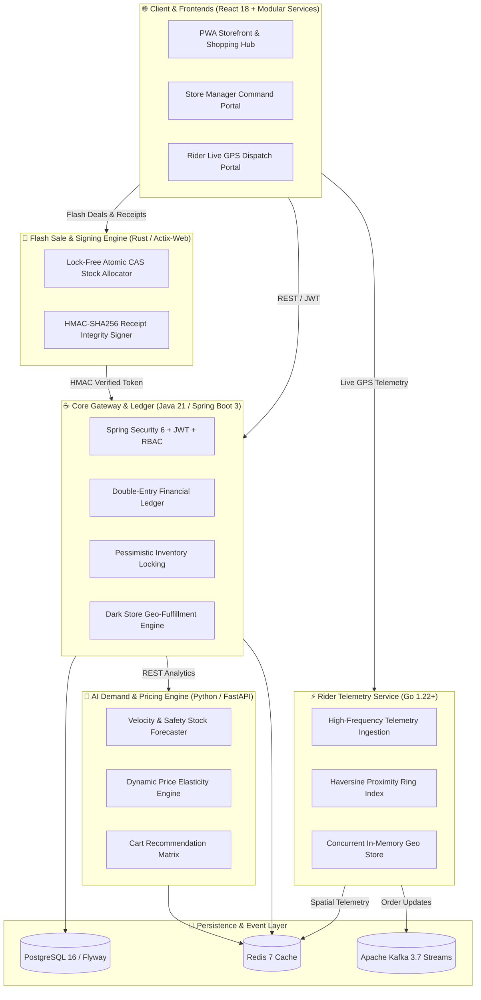

# ⚡ QuickCart — Enterprise Full-Stack Quick-Commerce Platform

<div align="center">

[](https://github.com/riya292100/new/actions/workflows/ci.yml)
[](https://github.com/riya292100/new/actions/workflows/codeql.yml)
[](https://github.com/riya292100/new/releases)
[](https://www.oracle.com/java/)
[](https://www.rust-lang.org/)
[](https://spring.io/projects/spring-boot)
[](https://www.python.org/)
[](https://golang.org/)
[](https://reactjs.org/)
[](https://vitejs.dev/)
[](https://www.postgresql.org/)
[](https://redis.io/)
[](https://www.docker.com/)
[](#-running-automated-tests)
[](LICENSE)

<p align="center">
  <b>Enterprise-grade, polyglot quick-commerce delivery platform</b><br>
  Built with <b>Java 21 / Spring Boot 3</b> (Core & Ledger), <b>Rust</b> (Flash Sale Allocation & Cryptographic Signing), <b>Python</b> (AI Demand & Dynamic Pricing), <b>Go</b> (Spatial Driver Telemetry), and <b>React 18</b> (Storefront PWA).
</p>

[Architecture Guide](docs/architecture.md) • [Development Setup](docs/development.md) • [Testing Strategy](docs/testing.md) • [Deployment Guide](docs/deployment.md) • [Security Policy](docs/security.md) • [Troubleshooting](docs/troubleshooting.md) • [Data Engineering](docs/data-engineering.md)

</div>

---

## 🌐 Remote Cloud Environment & Live Preview

* **Emergent Cloud IDE Preview URL**: [https://vscode-e01a03eb-31ea-4fd5-b789-791eee6ee17c.preview.emergentagent.com/](https://vscode-e01a03eb-31ea-4fd5-b789-791eee6ee17c.preview.emergentagent.com/)
* **Session ID / Key**: `a45cbc27`

---

## 🚀 Fresh Clone Quickstart (Zero-Friction Setup)

QuickCart works **immediately out-of-the-box from a clean fresh clone**. Follow these steps:

```bash
# 1. Clone repository
git clone https://github.com/riya292100/new.git quickcart
cd quickcart

# 2. Copy environment template
cp .env.example .env

# 3. Install dependencies across all workspaces
npm run install:all

# 4. Run the full polyglot stack (Docker Compose or Local)
# Option A: Fullstack via Docker Compose (Recommended)
docker compose up --build

# Option B: Run locally
# In separate terminals:
cd backend && ./mvnw spring-boot:run -Dspring-boot.run.profiles=dev  # Port 8080
cd services/ai-demand-engine && uvicorn app.main:app --port 8082     # Port 8082
cd services/telemetry-service && go run main.go                       # Port 8085
npm run dev                                                           # Port 5173
```

---

## 📦 Deterministic Lockfiles & Package Managers

Every language toolchain and package manager in this monorepo includes a committed lockfile for 100% reproducible installs:

| Service / Layer | Package Manager | Manifest File | Lockfile |
|---|---|---|---|
| **Root Monorepo** | `npm 10+` | [`package.json`](package.json) | [`package-lock.json`](package-lock.json) |
| **Frontend PWA** | `npm 10+` | [`frontend/package.json`](frontend/package.json) | [`frontend/package-lock.json`](frontend/package-lock.json) |
| **Core Java Backend** | `Maven 3.9+` | [`backend/pom.xml`](backend/pom.xml) | [`backend/mvnw`](backend/mvnw) / [`backend/mvnw.cmd`](backend/mvnw.cmd) |
| **AI Demand Engine** | `pip` / Python | [`services/ai-demand-engine/requirements.txt`](services/ai-demand-engine/requirements.txt) | [`services/ai-demand-engine/requirements.lock`](services/ai-demand-engine/requirements.lock) |
| **Spatial Telemetry** | `Go Modules` | [`services/telemetry-service/go.mod`](services/telemetry-service/go.mod) | [`services/telemetry-service/go.sum`](services/telemetry-service/go.sum) |
| **Flash Sale Engine** | `Cargo` | [`services/flash-sale-engine/Cargo.toml`](services/flash-sale-engine/Cargo.toml) | [`services/flash-sale-engine/Cargo.lock`](services/flash-sale-engine/Cargo.lock) |

---

## 🧪 Running Automated Tests

All tests run locally and in GitHub Actions CI with zero manual database or service provisioning required (in-memory H2 DB & standalone mocks are built-in).

### 1. Unified Monorepo Test (All Services)
```bash
npm run test:all
```

### 2. Individual Service Test Commands

#### 🌐 Frontend (React 18 / Vitest / V8 Coverage / ESLint / Prettier)
```bash
npm test
npm run test:coverage
```
* **Status**: `73 test files, 169 tests passing (100% PASS)`
* **Enforced Threshold Gates**: `Lines >= 70%, Statements >= 70%, Branches >= 60%, Functions >= 70%`
* **Static Analysis**: ESLint (0 errors, 0 warnings), Prettier 100% compliant

#### ☕ Java Backend (Spring Boot 3 / JUnit 5 / JaCoCo / Checkstyle)
```bash
npm run test:backend
# or standalone (in-memory test profile with zero external dependencies):
cd backend && ./mvnw clean test -Dspring.profiles.active=test
```
* **Status**: `119 unit & integration tests passing (100% PASS)`
* **Code Quality & Linting**: `Checkstyle` enforced (`backend/checkstyle.xml`, 0 violations)
* **Architecture & Telemetry**: Detailed in [`docs/architecture.md`](docs/architecture.md)

#### 🧠 Python AI Demand Engine (FastAPI / pytest / pytest-cov)
```bash
npm run test:python
# or standalone:
cd services/ai-demand-engine && python -m pytest tests -v --cov=app
```
* **Status**: `38 tests passing (100% PASS), 97% code coverage`

#### 📊 Python Data Pipeline & Quality Validation
```bash
npm run test:data-pipeline
# or standalone:
cd services/data-pipeline && python -m pytest tests -v
```
* **Status**: `7 tests passing (100% PASS)`

#### ⚡ Go Spatial Telemetry Service (Golang / go test)
```bash
npm run test:go
# or standalone:
cd services/telemetry-service && go test -v -race ./...
```
* **Status**: `Haversine Distance, Concurrent Spatial Tracker, and API Tests Passing (100% PASS)`

#### 🦀 Rust Flash Sale Engine (Actix-Web / cargo test)
```bash
npm run test:rust
# or standalone:
cd services/flash-sale-engine && cargo test
```
* **Status**: `Atomic CAS Claims & HMAC-SHA256 Token Signing Tests Passing`

---

## 🩺 System Health & Observability Endpoints

All core health probes and metric endpoints return structured system status:

| Service | Health Endpoint | Expected HTTP Status |
|---|---|---|
| **Java Backend** | `GET /actuator/health` | `200 OK` (`{"status":"UP"}`) |
| **Java Info** | `GET /actuator/info` | `200 OK` |
| **Python AI Engine** | `GET /healthz`, `GET /readyz` | `200 OK` |
| **Go Telemetry** | `GET /healthz`, `GET /readyz` | `200 OK` |
| **Rust Flash Sale** | `GET /healthz`, `GET /readyz` | `200 OK` |
| **Frontend Web** | `GET /` | `200 OK` |

Automated smoke testing script:
```bash
# POSIX (Linux / macOS / CI)
bash scripts/smoke-test.sh

# Windows PowerShell
powershell -ExecutionPolicy Bypass -File scripts/smoke-test.ps1
```

---

## 🏛️ Polyglot Microservice Architecture



---

## 🌐 Polyglot Service Portfolio

| Service | Language & Stack | Port | Purpose / Capabilities |
|---|---|---|---|
| **Core API Gateway** | **Java 21 / Spring Boot 3** | `8080` / `8081` | Authentication, multi-store dark store routing, pessimistic inventory locks, and immutable double-entry ledgers. |
| **Flash Sale Engine** | **Rust 1.80+ / Actix-Web** | `8086` | Sub-millisecond atomic CAS flash sale token reservation and HMAC-SHA256 digital receipt integrity signing. |
| **AI Demand Engine** | **Python 3.12 / FastAPI** | `8082` | Exponential smoothing demand forecasting, safety stock reorder point estimation, dynamic surge price elasticity, and cart co-occurrence recommendations. |
| **Spatial Telemetry** | **Go 1.22+ / Golang** | `8085` | High-throughput concurrent rider GPS ingestion, sub-millisecond Haversine proximity searches, and ETA calculations. |
| **Storefront & PWA** | **React 18 / Vite** | `5173` / `80` | Hyperlocal catalog, cart drawer, QuickCash loyalty, table bookings, customer support tickets, and live driver tracking. |

---

## 🔑 Pre-Seeded Demo Accounts (Development Only)

In development environments, default accounts are seeded for rapid verification:

| Role | Email | Default Password (Dev) | Capabilities |
|---|---|---|---|
| **Admin** | `admin@quickcart.com` | `Admin@123` | Full administrative control, financial ledger, dark stores, inventory |
| **Store Manager** | `manager@quickcart.com` | `Admin@123` | Store-level inventory updates, dispatch operations, workload management |
| **Support Agent** | `support@quickcart.com` | `Admin@123` | Support tickets, SLA escalation, return inspections, refunds |
| **Delivery Rider** | `driver@quickcart.com` | `Driver@123` | Driver portal, GPS simulator, order acceptance and delivery completion |
| **Customer** | `customer@quickcart.com` | `Customer@123` | Storefront browsing, cart, checkout, QuickCash wallet, table bookings |

> [!IMPORTANT]
> In production environments (`SPRING_PROFILES_ACTIVE=prod`), all credentials and JWT secrets must be set through environment variables (`DEMO_ADMIN_PASSWORD`, `JWT_SECRET`, etc.).

---

## 📚 Technical Documentation Suite

Explore the comprehensive technical documentation in the [`docs/`](docs/) directory:
- [System Architecture](docs/architecture.md)
- [Development Setup](docs/development.md)
- [Testing & Quality Assurance](docs/testing.md)
- [Deployment & Docker Orchestration](docs/deployment.md)
- [Security & Compliance](docs/security.md)
- [Troubleshooting & Diagnostics](docs/troubleshooting.md)
- [Data Engineering & Algorithms](docs/data-engineering.md)

---

## 📜 License

This project is licensed under the MIT License - see the [LICENSE](LICENSE) file for details.
