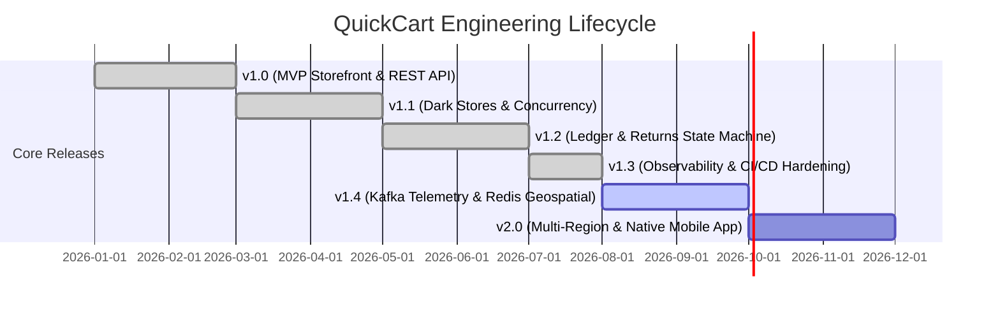

# 🗺️ QuickCart Project Roadmap & Milestone Tracker

Welcome to the **QuickCart** engineering roadmap. This document outlines our architectural vision, active development schedule, and scheduled feature milestones.

---

## 🎯 Milestone Overview

---

## 📦 Detailed Release Milestones

### ✅ Milestone 1: v1.0.0 — Foundation & Monolith MVP (Completed)
- [x] Initial React 18 + Vite storefront with category browsing and search.
- [x] Spring Boot 3 REST API with JWT authentication and RBAC (`ROLE_CUSTOMER`, `ROLE_ADMIN`).
- [x] Cart drawer, checkout, and mock Razorpay payment processing.
- [x] In-memory H2 database for zero-config local development.

### ✅ Milestone 2: v1.1.0 — Multi-Store Dark Store & Concurrency (Completed)
- [x] **Geospatial Geo-Allocation**: Haversine distance-based store discovery and order routing.
- [x] **Pessimistic Inventory Locking**: `@Lock(LockModeType.PESSIMISTIC_WRITE)` preventing overselling under 100+ concurrent threads.
- [x] **Driver Dispatch Portal**: Live order acceptance and GPS simulation for delivery partners.
- [x] **Restaurant Dining Hub**: Table reservations, dietary filters, and cuisine discovery.

### ✅ Milestone 3: v1.2.0 — Financial Ledger & Returns Engine (Completed)
- [x] **Double-Entry Financial Ledger**: Immutable audit journal for payments, refunds, and credits.
- [x] **Customer Support Ticketing**: Threaded messaging with SLA countdown timers.
- [x] **Returns & Inspection State Machine**: 7-day return window validation with automated wallet refunds.
- [x] **Product Demand ETL**: Hourly sales aggregation and automated data quality checks.

### ✅ Milestone 4: v1.3.0 — Enterprise CI/CD, CodeQL & Community Standards (Completed)
- [x] Comprehensive GitHub Actions CI/CD pipeline (Lint, Typecheck, Test, Build, Docker).
- [x] CodeQL automated static security analysis.
- [x] Standardized Issue Templates (Bug Report, Feature Request) & PR Template.
- [x] Automated release publisher on version tag (`v*`).
- [x] 100% test pass rate across 95 backend tests and 123 frontend tests.

### 🚀 Milestone 5: v1.4.0 — Event Streaming & Geospatial Clustering (In Progress)
- [ ] **Apache Kafka Event Bus**: Real-time driver GPS coordinates and order state transitions.
- [ ] **Redis GEO Integration**: Sub-millisecond geospatial queries using `GEOADD` and `GEORADIUS`.
- [ ] **Push Notification Gateway**: Web Push and Firebase Cloud Messaging (FCM) integration.
- [ ] **Dynamic Surge Pricing**: Real-time delivery fee adjustment based on dark store load ratios.

### 🌟 Milestone 6: v2.0.0 — Multi-Region Cloud & Native Mobile Apps (Planned)
- [ ] **Native Mobile Deployment**: Capacitor iOS and Android builds with biometric authentication.
- [ ] **Multi-Region PostgreSQL Replication**: Read-replica routing for catalog search.
- [ ] **OpenTelemetry & Grafana Dashboards**: End-to-end distributed tracing across micro-services.
- [ ] **AI-Powered Recommendation Engine**: Vector similarity search for personalized shopping suggestions.

---

## 📅 Development Schedule & Cadence

| Activity | Frequency | Objective |
|---|---|---|
| **Feature Sprints** | Bi-weekly | Deliver incremental milestone capabilities. |
| **Dependency Audits** | Weekly (Mondays) | Automated Dependabot updates for npm & Maven. |
| **Security Review** | Bi-weekly | CodeQL static scans and third-party CVE assessments. |
| **Release Cadence** | Monthly | Semantic minor releases (`v1.x.0`) with changelog publication. |

---

## 💬 Feature Requests & Contributions
Have an idea or want to contribute to an upcoming milestone?
- Open a [Feature Request](https://github.com/riya292100/new/issues/new?template=feature_request.yml)
- Review our [Contributing Guide](CONTRIBUTING.md) and pick an issue labeled `good first issue`!
