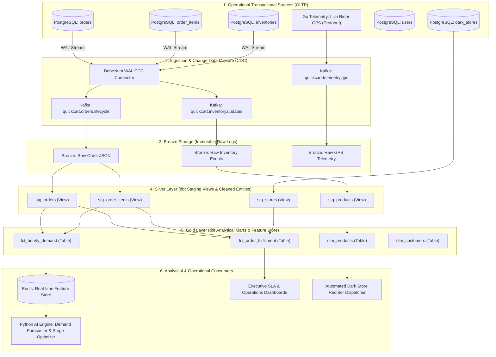

# QuickCart Data Lineage & End-to-End Pipeline Graph

## 1. End-to-End Lineage Flow

---

## 2. Model & Table Dictionary

| Layer | Object Name | Type | Primary Key | Description | Data Tests Enforced |
|---|---|---|---|---|---|
| **Staging** | `stg_orders` | View | `order_id` | Standardized order records | `unique`, `not_null` |
| **Staging** | `stg_order_items` | View | `order_item_id` | Granular basket line items | `unique`, `not_null`, `relationships` |
| **Staging** | `stg_products` | View | `product_id` | Catalog items and prices | `unique`, `not_null` |
| **Staging** | `stg_stores` | View | `store_id` | Dark store hubs and geolocations | `unique`, `not_null` |
| **Marts** | `fct_order_fulfillment` | Table | `order_id` | Delivery SLA duration, revenue, compliance | `unique`, `not_null` |
| **Marts** | `fct_hourly_demand` | Table | `order_hour, store_id, product_id` | Aggregated sales velocity per hour | `not_null` on composite grain |
| **Marts** | `dim_products` | Table | `product_id` | Product dimension enriched with stock health | `unique`, `not_null`, `accepted_values` |

---

## 3. Data Quality & Gating Invariants

All transformations run through the [`DataValidator`](file:///c:/Users/HP/Desktop/new/services/data-pipeline/data_validator.py) engine:
1. **Zero-Null Invariants**: Mandatory fields (`order_number`, `total_amount`, `store_id`, `product_id`) must have 0% null records.
2. **Referential Integrity**: 100% of order items must map to existing orders and products.
3. **Numeric Bounds Check**: Product selling prices and order totals must be > 0.00 and <= upper anomaly thresholds.
4. **Enum Conformance**: Order statuses strictly match `['CONFIRMED', 'PACKING', 'OUT_FOR_DELIVERY', 'DELIVERED', 'CANCELLED']`.

---

## 4. Orchestration & Scheduling

- **Orchestrator**: [`PipelineOrchestrator`](file:///c:/Users/HP/Desktop/new/services/data-pipeline/orchestrator.py) & [`Airflow DAG`](file:///c:/Users/HP/Desktop/new/services/data-pipeline/dags/quickcart_etl_dag.py).
- **Execution Interval**: Hourly (`@hourly`) with automated dependency resolution, retry policies (3 retries, exponential jitter), and telemetry logging.
